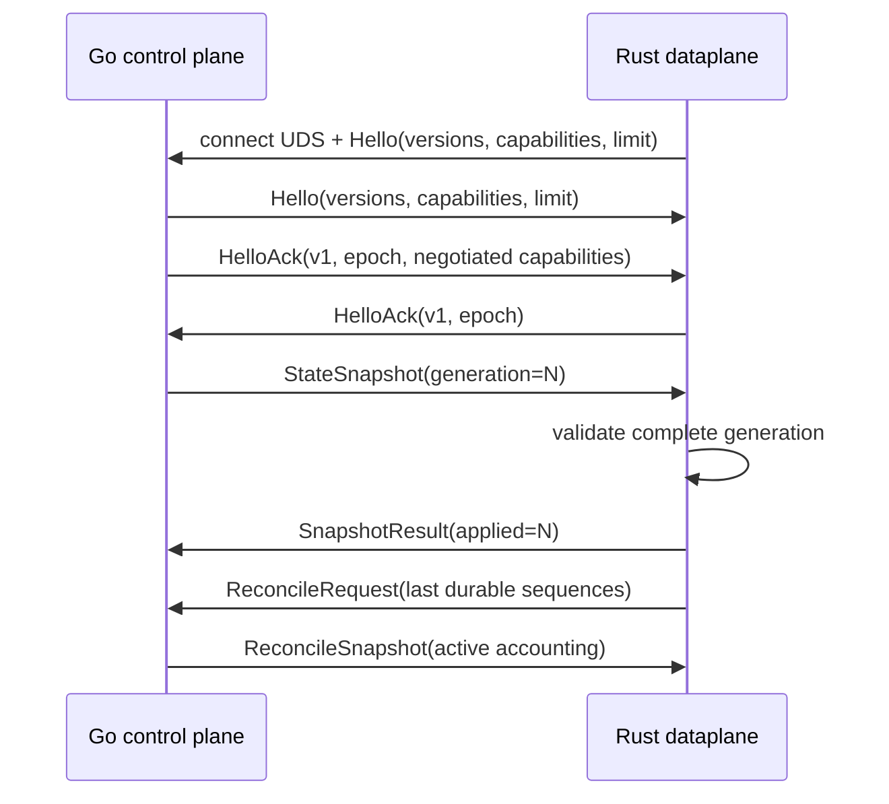
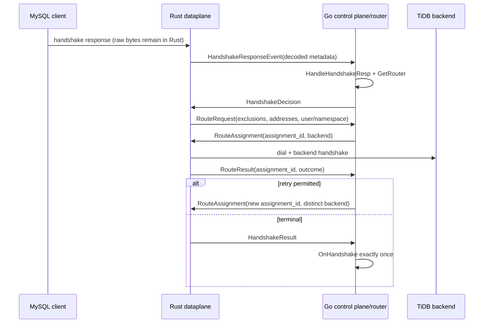

# Rust dataplane control protocol v1

## Status and decision

This ADR freezes version 1 of the process boundary between the existing Go
control plane and the Rust SQL dataplane. The normative schema is
`proto/dataplane/v1/control.proto`. The parity manifest at
`docs/design/rust-dataplane-parity.md` remains the source of truth for
externally visible MySQL behavior.

The boundary is intentionally narrow:

- Rust owns SQL listeners, frontend and backend sockets, TLS, compression,
  PROXY protocol, MySQL packet parsing, authentication bytes, command state,
  session migration, and per-connection I/O.
- Go owns validated configuration, certificate lifecycle, discovery, routing,
  balancing, namespaces, redirect selection, metering export, public APIs, and
  VIP management.
- The IPC stream carries decoded control metadata and lifecycle events. It
  never carries raw MySQL packets, queries, result rows, authentication
  response bytes, TLS key material, or file contents. There is no cgo or FFI.
- Rust reads certificate and CA files from paths in a validated snapshot. A
  snapshot is not active until Rust has parsed every referenced file and
  validated the complete generation.

Changing a field additively is compatible when old peers may safely ignore it.
Changing an existing field's meaning, wire type, required behavior, ordering
semantics, or security boundary requires protocol v2.

## Transport and framing

The control channel is a Unix domain `SOCK_STREAM`. Go creates the socket with
mode `0600` by default and rejects a peer whose operating-system credentials do
not match the configured Rust process identity. Rust verifies the socket owner
and mode before connecting. Deployments that deliberately use different UIDs
must name an allowed UID in process configuration; group/world-writable sockets
are always rejected.

Each record is:

```
4-byte unsigned big-endian protobuf length
ControlEnvelope protobuf bytes
```

The v1 hard frame limit is 1 MiB, including the protobuf body but excluding the
length prefix. A peer may advertise a smaller limit in `Hello`; the negotiated
limit is the minimum. A zero length, a length above the negotiated limit, a
truncated body, an invalid protobuf, or trailing bytes in a record is a fatal
stream error. The receiver sends a best-effort `ProtocolError` when possible,
then closes the stream. Implementations must use exact-read/exact-write loops;
partial reads and writes are normal and do not change message boundaries.

Normal builds perform no schema generation and require no network access.
Generated Go and Rust sources are committed; regeneration is an explicit,
pinned developer/CI operation.

## Connection establishment and ownership

Only one control connection may own a Rust dataplane process at a time.
Immediately after `accept`/`connect`, both peers exchange `Hello`. No other
message is legal before `HelloAck` selects version 1, a frame limit, a fresh
nonzero control epoch, and the intersection of optional capabilities.

Go is the epoch authority. Every accepted connection receives a strictly
greater epoch. Rust closes an older connection after accepting a newer epoch;
Go rejects a simultaneous second connection for the same Rust process ID.
Messages from an old epoch are stale and must not mutate state.

The Go `Hello` **must** carry a nonempty `process_id` and a nonzero
`process_started_unix_millis`. Together these two fields are the Go **process
lineage**: the identity generation-application, snapshot rollover, and
session-scoped work are all judged against (see "Envelope identity and
ordering" and "Snapshots and generation application"). This requirement is
**v1-global and unconditional** — it does not depend on any negotiated
capability, because the wire `control_epoch` VALUE is reused across Go restarts
(a fresh Go process starts its generation sequence at 1 and can be assigned an
epoch value a previous process already used), so the lineage pair is the only
field that safely distinguishes one Go process from its own restart. Two
restarted peers both presenting `("", 0)` would be indistinguishable and the
generation-reset acceptance would silently regress to serving a dead process's
desired state. Rust therefore rejects a Go `Hello` missing either field at
handshake, before `HelloAck`, with a `PROTOCOL_VIOLATION`-class transport
error; the connection is not established and Rust reconnects.

`required_capabilities` is an envelope-level guard. A receiver that lacks any
listed capability rejects that request with `MISSING_CAPABILITY`; it must not
silently approximate the operation. Unknown optional protobuf fields and
unknown enum values are preserved/ignored according to protobuf rules. An
unknown body variant is not actionable and yields `PROTOCOL_VIOLATION`.

The v1 capability registry is append-only:

| Value | Name | Required for |
| ---: | --- | --- |
| 1 | `PER_CONNECTION_CLOSE` | `CloseCommand` / `CloseResult` |
| 2 | `RECONCILE_CONNECTIONS` | the `ReconcileRequest.connections` field |
| 3 | `RECONCILE_SESSION_REHYDRATION` | connection rehydration under `RECONCILE_CONNECTIONS`: the reconcile carries per-connection identity, applied generation, and pending-command watermarks so Rust re-adopts surviving sessions across a control reconnect and Go resumes their redirect/drain/close lifecycle without re-issuing terminals or orphaning in-flight commands |

The mandatory Go `Hello` process lineage (above) is deliberately **not** gated
on any of these capabilities: it is required whenever a Go control plane speaks
v1 at all, so lineage safety holds even for a peer that negotiates none of the
optional capabilities.

A sender sets the corresponding value in `required_capabilities` whenever it
uses one of these additions. An older peer therefore rejects the guarded
operation instead of decoding an unknown oneof body or silently ignoring the
active-connection inventory.



## Envelope identity and ordering

- `control_epoch` identifies the owning stream and is required after Hello.
- `generation` is nonzero for state-bearing messages. Snapshots apply only when
  their generation is greater than the last applied generation in the same
  Go process lineage. An equal generation with identical bytes is an
  idempotent duplicate; an equal generation with different bytes is a protocol
  violation. A lower generation is rejected as stale.
- `request_id` is nonzero for command/result pairs and monotonically increases
  per sender within an epoch. Duplicate IDs replay the cached terminal result;
  they never repeat a callback, assignment, redirect, drain, or close action.
- Event batches have their own sequence numbers so metrics and metering can be
  reconciled without coupling them to request IDs.
- Receivers may observe different priority lanes out of request-ID order. A
  response always carries the initiating request ID, and per-connection state
  transitions remain serialized by `connection_id`.

No protocol message assumes exactly-once delivery. Commands are at-least-once
over reconnect plus idempotency keys; externally visible effects are exactly
once. Senders retain terminal command results and unacknowledged accounting
deltas until reconciliation makes them obsolete.

## Queues, priority, and backpressure

Each implementation owns three bounded outbound queues. Defaults and v1 hard
maxima are:

| Lane | Contents | Default | Hard maximum | Full behavior |
| --- | --- | ---: | ---: | --- |
| Critical | Hello/error/heartbeat, assignment results, redirect/drain, close, reconciliation | 1,024 messages / 8 MiB | 4,096 / 32 MiB | Stop accepting new work; close the unhealthy control stream if space is not available before its deadline. Never drop. |
| Control | snapshots, route requests/assignments, handshake decisions/events | 4,096 / 32 MiB | 16,384 / 128 MiB | Apply producer backpressure; new sessions fail closed after the last-good grace expires. Never drop accepted work. |
| Bulk | metrics and metering deltas | 256 / 16 MiB | 1,024 / 64 MiB | Coalesce by series/key; metrics may be dropped with a local drop counter. Metering is retained to disk or backpressured and is never silently lost. |

Scheduling uses a bounded weighted cycle of 16 critical, 8 control, and 1 bulk
records. A continuously busy lane therefore cannot starve the others. Critical
redirect, drain, assignment result, connection-close, and reconciliation
records are never displaced by metrics. Queue accounting includes protobuf
bytes and fixed per-entry overhead, not only message count.

### Metrics batch catalog semantics

`MetricDelta` is interpreted only through the closed metric catalog shared by
the Rust producer and Go consumer. Counters carry a non-negative
`counter_delta`. Gauges carry an absolute `gauge` value and are resent every
export interval, including after reconnect. Histograms carry the sample-count
delta in `counter_delta`, the sample-sum delta in `gauge`, and one cumulative
bucket delta for every finite bucket of the named existing Prometheus
histogram, in ascending-bound order. The Go collector adds these remote
values to the same names, help strings, labels, sums, counts, and buckets as
the Go dataplane; no parallel Rust-only series is exposed.

Names, label keys, enumerated label values, label byte lengths, batch entries,
and retained series are bounded at both peers. Unknown or malformed metric
entries are counted and discarded without closing the control stream. The SQL
path writes only to a bounded non-blocking observation queue; a full queue or
bulk lane increments a local drop counter and never blocks SQL, drain,
reconciliation, or metering. Counter/histogram deltas remain locally
coalesced until a batch is accepted by the Rust transport, while metrics as a
whole remain best effort once written. Metering continues to use its separate
durable, acknowledged ledger and never shares this loss policy.

| Owner/source | Existing Prometheus series carried by `MetricsBatch` | Bounded labels |
|---|---|---|
| Listener/session lifecycle | `tiproxy_server_connections`, `tiproxy_server_create_connection_total`, `tiproxy_server_reject_connection_total`, `tiproxy_server_disconnection_total` | rejection `type` is `memory` or `max_connections`; disconnection `type` is the closed Go quit-source enum |
| Session commands | `tiproxy_session_query_total`, `tiproxy_session_query_duration_seconds`, `tiproxy_session_handshake_duration_seconds`, `tiproxy_session_query_time_since_conn_creation_seconds`, `tiproxy_session_conn_lifetime_seconds` | backend address plus the fixed 32-value MySQL command enum where applicable |
| Routing/traffic | `tiproxy_backend_get_backend_duration_seconds`, `tiproxy_backend_get_backend`, `tiproxy_backend_dial_backend_fail`, `tiproxy_traffic_inbound_bytes`, `tiproxy_traffic_inbound_packets`, `tiproxy_traffic_outbound_bytes`, `tiproxy_traffic_outbound_packets`, `tiproxy_traffic_cross_location_bytes` | backend address and `res={succeed,fail}` where applicable |
| Rust/control health | `tiproxy_server_event`, `tiproxy_server_err` | closed Rust event/error enums for reconnects, local observation/batch drops, control drops/failures, and listener/runtime failures |

Migration counters, pending gauges, and backend connection gauges remain
Go-owned observations of projected connection/redirect lifecycle events; they
are not duplicated in `MetricsBatch`. This preserves their current names and
single ownership while Rust session migration support is completed separately.

## Heartbeats, deadlines, and reconnect

Both peers send a heartbeat every second when no higher-priority record has
been sent. Three missed intervals make the stream unavailable. All reads,
writes, and queue waits have cancellation-aware deadlines. EOF, timeout, and
shutdown cancel and join every transport task; neither side may leave a reader,
writer, heartbeat, or reconnect task orphaned.

Rust reconnects with full jitter from 50 ms up to a 5-second cap. The wait is
cancellable. Successful Hello resets the backoff. Go does not create multiple
listener goroutines for a reconnect; one transport owner accepts, verifies,
and serially replaces the peer.

## Last-good state and control loss

Control loss never tears down an already established SQL session. Rust keeps
the immutable configuration, certificate handles, backend identity, and
connection-scoped protocol settings captured by that session. It continues
ordinary command forwarding and reports buffered accounting after reconnect.

The v1 last-good grace for new sessions is 30 seconds from the last valid
heartbeat. During the grace, Rust may accept a new session only from the last
successfully applied snapshot and must mark it for reconciliation. After the
grace, listeners may remain bound but every new connection fails closed before
session allocation. Redirect and graceful-drain commands pause immediately on
control loss; a locally configured process-shutdown deadline is still honored.
No new route lease may outlive the grace deadline.

On reconnect, Rust sends applied generation, active connection/backend pairs,
pending redirect IDs, and last durable event/metric/metering sequences. Go
rebuilds idempotency/accounting state before issuing new redirects or drain.
The active pairs are carried in `ReconcileRequest.connections` and require the
`RECONCILE_CONNECTIONS` capability. Go replies with `ReconcileSnapshot` after
it has removed absent Rust connections from router accounting and identified
any Rust connection unknown to the current Go lineage.

## Snapshots and generation application

Go validates source configuration before publishing. A state snapshot is a
complete replacement, not a patch, and its generation covers configuration,
listeners, TLS policy, backend discovery, and namespace routing together. Rust
validates into an isolated candidate, including address syntax, limits,
capability mask, traffic-replay exclusion, certificate/key pairing, CA/policy,
and listener conflicts. It atomically swaps the candidate only after all checks
pass. Failure returns `INVALID_SNAPSHOT` or `UNSUPPORTED_CONFIGURATION` and
keeps the previous generation unchanged.

Existing sessions retain their old TLS context and connection-scoped settings.
New sessions use the newly committed generation. Listener additions may be
bound before the swap but cannot accept until commit; listener removals stop
accepting at commit and drain existing sessions. Fields documented as
restart-required cause snapshot rejection rather than partial application.

`pkg/controlbridge.SnapshotBuilder` is the Go translation boundary. It clones
and runs `Config.Check`, normalizes listener/CIDR/duration values, resolves the
default connection buffer, canonicalizes allowlisted TLS paths, and emits a
complete `StateSnapshot` in the control lane. `control-proto::snapshot` is the
Rust validation boundary. It parses every certificate, key, and CA into an
isolated candidate, checks certificate validity and key pairing, and swaps one
`Arc<ValidatedSnapshot>` under a write lock only after every field succeeds.
An equal generation with identical contents reuses the same `Arc`; stale,
conflicting, invalid, or unsupported generations return a redacted reason and
leave the old `Arc` untouched. A session captures that immutable handle when it
starts, so later certificate rotation affects new sessions without mutating an
established session's TLS context. The session also owns a last-good generation
receiver used only for explicitly live fields: current backend health may
re-select the captured generation's healthy/unhealthy keepalive policy.

The Rust-mode reload contract is:

| Snapshot field or source setting | Rust-mode behavior | Reason |
| --- | --- | --- |
| `max-connections`, memory threshold, connection buffer | Reloadable; new admission/session state uses the committed generation. | No listener or process identity changes. |
| Frontend/healthy-backend/unhealthy-backend keepalive | Reloadable for new connections; an established session keeps its captured policy values but re-selects healthy versus unhealthy from live topology immediately at a safe command boundary and after migration, with a five-second retry ticker. | No mixed-generation policy values; only the health selector is live. |
| PROXY v2 mode, backend TLS requirement, graceful timers, public CIDRs | Reloadable for new connections and new drain operations. | Complete snapshot replacement avoids mixed policy. |
| Frontend/backend certificate, key, CA paths; TLS minimum; allowed CNs; skip-CA policy | Reloadable after Rust rereads and validates every referenced regular file beneath the configured TLS roots. Atomic rename to a new file path is supported. | Existing sessions retain their captured generation; invalid/expired/mismatched material keeps last-good. |
| Backend discovery and namespace routing entries | Reloadable as part of the same generation. | A session's selected namespace/backend identity remains connection-stable. |
| `proxy.addr` and `proxy.port-range` | Restart-required; the Go builder rejects a changed listener set. | Listener ownership and bind lifecycle are established at process startup in v1. |
| Process work directory, API listener, log encoding, metering sink, HA/VIP identity | Restart-required and absent from the dataplane snapshot. | These remain Go process/control-plane ownership. |
| `auto-certs` | Unsupported in Rust mode; use shared certificate files. | Ephemeral Go in-memory keys must never cross IPC. |
| Traffic capture/replay | Unsupported; snapshot application fails fast. | This is the explicit dataplane rewrite exclusion. |

Go and Rust both require absolute, canonical certificate paths below a
deployment-provided directory allowlist. Diagnostics identify only the policy
field and failure class; they never include file contents, authentication data,
or key material.

## Handshake and routing lifecycle

Rust sends decoded, bounded handshake metadata only. `AuthData`, salt, auth
switch packets, queries, attributes outside the configured size limit, and raw
packet bytes never cross IPC. Go applies the handler policy, selects a
namespace/router, and returns a decision. Rust owns backend dialing and auth.
The initial snapshot supplies `GetCapability` and `GetServerVersion`. A
`HandshakeResponseEvent` invokes `HandleHandshakeResp` followed by `GetRouter`;
a backend SQL handshake failure is returned as a structured `MysqlError` and
invokes `HandleHandshakeErr`; terminal `HandshakeResult`, traffic, and close
events invoke `OnHandshake`, `OnTraffic`, and `OnConnClose` respectively. The
projection passed to Go has no `AuthData`; a custom handler that requires or
mutates raw authentication bytes is incompatible with Rust mode and must fail
closed during capability negotiation rather than receive a redacted surrogate.



`assignment_id` reserves router score until one terminal `RouteResult` or
connection close. Go calls selector `Finish` exactly once. Duplicate results
return the cached outcome. A Rust restart reconciles active assignments before
Go releases or re-creates score. `ConnectionEvent(CLOSED)` invokes
`OnConnClose` and router close accounting exactly once even when it races with
redirect completion.

Decoded connection attributes are capped at 64 KiB total, 1,024 entries, and
4 KiB per key/value. Oversized metadata is rejected locally by Rust. Error
detail is diagnostic text capped at 4 KiB and must not contain auth bytes,
queries, TLS material, or secrets. Client-facing errors use an enumerated code
plus an approved message; arbitrary Go diagnostic strings are not sent to the
client.

## Redirect and drain

Redirect commands are keyed by `(connection_id, redirect_id)`. Rust serializes
them with command processing, defers while the session is unsafe, and emits one
terminal result. A lost result is replayed after reconciliation. Go does not
issue a new redirect for that connection until the prior ID is terminal.

Drain is keyed by `drain_id`. It first stops selected listeners or assignments,
then asks sessions to close only at safe points until the graceful deadline,
then force-closes at the force deadline. Repeating a drain ID returns current
progress. A different concurrent drain is rejected as `DRAIN_IN_PROGRESS`.

Router eviction uses `CloseCommand`, keyed by `(connection_id, close_id)`, and
requires `PER_CONNECTION_CLOSE`. Rust replies once with `CloseResult` and then
emits the ordinary terminal `ConnectionEvent(CLOSED)`. A duplicate close ID
replays the cached result; a different close ID for an already-closing session
returns its current state without scheduling a second close. `force=true`
maps `RedirectableConn.ForceClose`; listener/backend-wide graceful shutdown
continues to use `DrainCommand` and must not be overloaded for one connection.

## Error codes

| Code | Meaning and required action |
| --- | --- |
| `UNSUPPORTED_VERSION` | No common version; close without retry storm. |
| `MISSING_CAPABILITY` | Receiver cannot safely execute required behavior; reject only that operation unless it affects Hello. |
| `FRAME_TOO_LARGE`, `MALFORMED_FRAME`, `PROTOCOL_VIOLATION` | Fatal stream violation; best-effort error then close. |
| `STALE_EPOCH` | Ignore old-owner traffic and close the stale stream. |
| `STALE_GENERATION` | Keep last-good snapshot; sender must reconcile. |
| `DUPLICATE_REQUEST` | Return cached terminal result; do not repeat effects. |
| `QUEUE_FULL` | Apply the lane-specific policy; critical/control data is not silently dropped. |
| `CONTROL_UNAVAILABLE`, `GRACE_EXPIRED` | Existing sessions continue; pause redirects/drain; bound or reject new work as specified above. |
| `INVALID_SNAPSHOT`, `UNSUPPORTED_CONFIGURATION` | Keep last-good generation and report the rejected field without secrets. |
| `NO_BACKEND`, `BACKEND_DIAL_FAILED`, `HANDSHAKE_REJECTED` | Finish the assignment once; retry only when the handler/router decision permits it. |
| `REDIRECT_UNSAFE`, `REDIRECT_FAILED` | Preserve the old usable session and emit one terminal redirect result. |
| `RECONCILIATION_REQUIRED` | Pause mutating commands until state exchange completes. |
| `INTERNAL` | Fail the affected request closed; reconnect only if stream integrity is uncertain. |

## Compatibility and upgrade policy

| Go | Rust | Result |
| --- | --- | --- |
| v1 only | v1 only | Negotiate v1. |
| v1 + optional capability X | v1 without X | Negotiate v1; X may be used only when not required. |
| v1 requiring X | v1 without X | Reject the guarded operation with `MISSING_CAPABILITY`. |
| v1/v2 | v1 | Select v1 and emit only v1 semantics. |
| v1 | v2 only | Reject Hello with `UNSUPPORTED_VERSION`. |
| any | malformed/oversized Hello | Close; do not fall back to an unversioned protocol. |

Rolling upgrade order is: deploy a peer that understands both old and new
additive fields, observe negotiation, then enable the optional capability.
Removing v1 or making a capability required needs a separate compatibility
decision and a rollback-tested drain. Downgrade follows the reverse order.
Schema field numbers are never reused; removed fields are reserved.

## Security and operational invariants

- Authentication bytes, MySQL payload, private keys, certificates, and CA file
  contents are forbidden on the stream and in diagnostic detail.
- Paths are absolute, normalized, beneath configured allowlisted directories,
  and opened without following an unexpected ownership change.
- Metrics labels and connection attributes are bounded before allocation.
- State and result logs include epoch, generation, request ID, connection ID,
  and error code, but not secrets.
- Traffic capture/replay enabled in a snapshot is
  `UNSUPPORTED_CONFIGURATION`; Rust mode must fail fast.

## CTL-06 chaos-E2E acceptance

The lost-event repair and one-sided-restart guarantees above are exercised
end-to-end against a real TiUP playground by four chaos chains in
`tests/dataplane/integration` (`run.sh --mode rust --variant plain`, the
keyspace-guard phase). A test-only control-frame dropper
(`controldropper/`) sits transparently between the Rust dataplane and the Go
control socket and, when armed, loses exactly one identified Rust→Go frame; the
Go router's per-backend `tiproxy_balance_b_conn` gauge and the successor
`/api/dataplane/status` generation are the oracles. Each chain asserts an
*exact* accounting transition, not merely a direction:

- **(a) lost `RouteResult{connected}`** — the connection is live but Go's
  accounting is short by one; the automatic reconcile on the next control
  reconnect completes the lost assignment, restoring the count to exactly `+1`
  (never double-counted). Proves the exactly-once reconcile repair of a
  successful RouteResult the Go side accepted-as-sent but never observed.
- **(b) lost `ConnectionEvent{CLOSED}`** — Go holds a ghost; the reconcile's
  identification-by-omission closes it to exactly the live count, never negative.
- **(c) one-sided Go restart** — the Rust data session rides through the
  control-plane crash unchanged (same `CONNECTION_ID()`, same backend), the new
  Go incarnation (distinct PID, fresh generation sequence) applies a snapshot,
  and its accounting rehydrates to exactly the surviving count.
- **(d) one-sided Rust restart** — the dead session leaves a ghost (no CLOSED
  was sent); the successor Rust reconnects with an empty inventory, the reconcile
  omission zeroes the ghost, and a fresh session is admitted and counted under
  the new incarnation (`connection_ready` carries the applied generation).

The dropper selectors are exact on `connection_id` (mandatory) so a concurrent
same-kind frame for another connection is never eaten;
`route-result-connected` leaves `assignment_id` optional because it is
unobservable before the frame is sent, while `connection-event-closed` also
pins `backend_id`. See `tests/dataplane/integration/README.md` for the harness
contract and evidence surface.

## Review and change control

The schema, this ADR, and generated compatibility fixtures must be reviewed by
owners representing the Go router/control plane, Rust dataplane, SRE, and
TiProxy/MySQL protocol behavior. Their approvals are recorded in the table
below. Until all rows are complete, implementation may proceed against v1 but
the issue remains open.

| Role | Reviewer | Revision | Result | Date |
| --- | --- | --- | --- | --- |
| Go router | bb7133 (owner; approval recorded by owner merge of the signoff PR) | `proto/dataplane/v1/control.proto` | PASS | 2026-08-25 |
| Rust dataplane | ClaudeHome (agent; independent of the CTL implementation) | `proto/dataplane/v1/control.proto` | PASS — semantics implementable as specified; bulk-lane metering durability format is deferred to the DPL-06 implementation | 2026-08-25 |
| SRE/operations | bb7133 (owner; approval recorded by owner merge of the signoff PR) | this ADR | PASS | 2026-08-25 |

Any correction to the frozen failure, ordering, or security semantics requires
a new ADR and protocol v2. Additive v1 fields still require cross-language
golden coverage before use.
