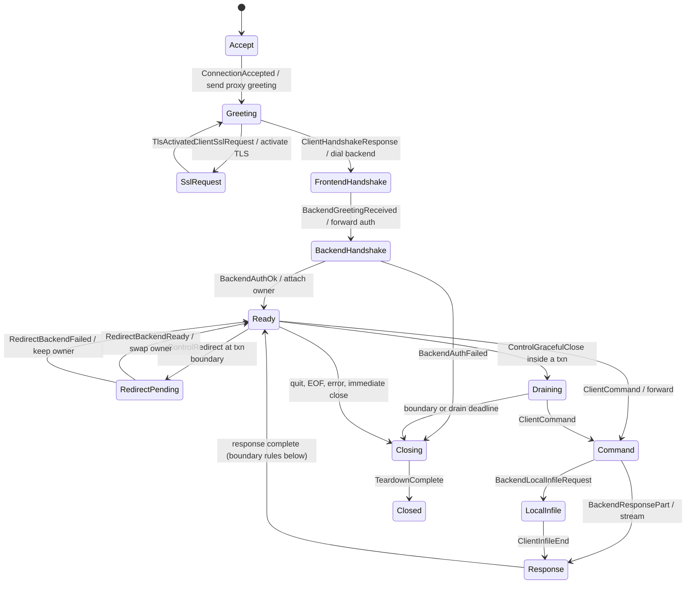

# TiProxy session lifecycle

`session-core` owns session state machines and, from WIRE-07, the
Go-compatible failure taxonomy (`error_source`):

- `ErrorSource` metric labels are byte-identical to Go's
  `ErrorSource.String()` — dashboards key on them, and a pin test enforces
  every string.
- `ErrorSource::classify` encodes Go `Error2Source`'s precedence exactly
  (side-attributed disconnects first, malformed/sequence as proxy bugs,
  handshake classes, authentication, no-backend, SQL error, cancellation,
  proxy-error catch-all), proven on combined-failure descriptors.
- `client_response` is Go `ErrToClient`'s allowlist: fixed static responses
  for the listed failures, silence for everything else, so internal detail
  (paths, certificates, control payloads) cannot reach a client by
  construction.

## Session FSM (`fsm`, SES-00)

Pure state machine: classified events in, effects out. No I/O, no timers,
no packet payloads (classification happens in the wire/transport layers).

Boundary rules (Go `backend_conn_mgr.go` parity): redirect and graceful
close both wait for the transaction boundary; graceful close wins over a
pending redirect; a failed migration keeps the current backend; requests
arriving during migration are held and replayed; a migration completing
during close reports failure. The complete legal transition relation is the
`TRANSITIONS` table, proven exactly equal to the machine by an exhaustive
reachability test over the full state × flag space (`tests/fsm_model.rs`),
which also proves: no two backend owners, no authenticated state without
authentication, no effects after `Closed`.
