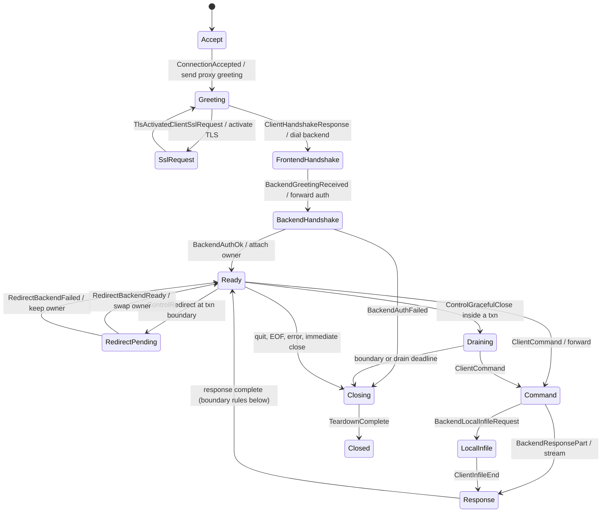

# TiProxy session lifecycle

`session-core` owns session state machines and, from WIRE-07, the
Go-compatible failure taxonomy (`error_source`):

- `ErrorSource` metric labels are byte-identical to Go's
  `ErrorSource.String()` — dashboards key on them, and a pin test enforces
  every string.
- `ErrorSource::classify` encodes Go `Error2Source`'s precedence exactly
  (side-attributed disconnects first, malformed/sequence as proxy bugs,
  handshake classes, authentication, no-backend, SQL error, cancellation,
  proxy-error catch-all), proven on combined-failure descriptors.
- `client_response` is Go `ErrToClient`'s allowlist: fixed static responses
  for the listed failures, silence for everything else, so internal detail
  (paths, certificates, control payloads) cannot reach a client by
  construction.

## Session FSM (`fsm`, SES-00)

Pure state machine: classified events in, effects out. No I/O, no timers,
no packet payloads (classification happens in the wire/transport layers).

Boundary rules (Go `backend_conn_mgr.go` parity): redirect and graceful
close both wait for the transaction boundary; graceful close wins over a
pending redirect; a failed migration keeps the current backend; migration
is serialized with command execution (Go `processLock`), so client
requests during it are illegal at the FSM level — Go's narrow
hold-and-replay of an in-transaction `BEGIN` (`needHoldRequest`, MIG-005)
is deferred to SES-07; every accepted redirect signal is retired with
exactly one result, including across close and teardown (synchronous
failure at close, one-shot suppression of the late in-flight result);
graceful close before authentication closes immediately
(`TestGracefulCloseBeforeHandshake`). The complete legal transition
relation is the
`TRANSITIONS` table, proven exactly equal to the machine by an exhaustive
reachability test over the full state × flag space (`tests/fsm_model.rs`),
which also proves: no two backend owners, no authenticated state without
authentication, no effects after `Closed`.

## Handshake negotiation (`handshake`, SES-01)

Pure first-handshake policy frozen from Go `authenticator.go` (the wire
layouts live in `mysql-wire::handshake`):

- `SUPPORTED_SERVER_CAPABILITIES` bit-pinned to Go's literal union;
  `PROTOCOL_41` required from the frontend (fixed
  `ER_NOT_SUPPORTED_AUTH_MODE` 1251/`08004` response when missing);
  `DEPRECATE_EOF` required from the backend only when the session
  negotiated it; `require-backend-tls` enforcement.
- Go tolerances preserved: `PLUGIN_AUTH` force-set for clients that omit
  the bit; the `SSLRequest` capability mask wins over a differing
  handshake-response mask (trust-first); backend under-advertisement is
  reported for logging and otherwise ignored (excluding `SSL`).
- Size gates: 1-MiB pre-read cap (shared limits registry) and the
  32-byte minimum for the first client packet.
- `RoutingHandshake` is the routing gate: constructible only from a
  parsed response, so `DialBackend` cannot run before username and
  client metadata exist.
- `tests/handshake_matrix.rs` runs representative driver capability
  profiles (mysql CLI 8.0, go-sql-driver, Connector/J, legacy
  libmysqlclient, zstd, TLS-with-dropped-SSL-bit) end-to-end through
  codec + policy, plus exhaustive truncation sweeps (no prefix panics or
  decodes).
