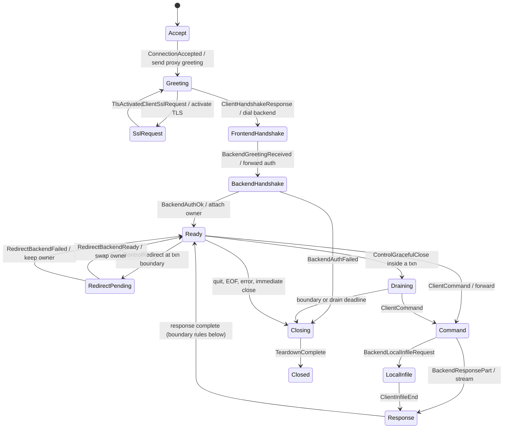

# TiProxy session lifecycle

`session-core` owns session state machines and, from WIRE-07, the
Go-compatible failure taxonomy (`error_source`):

- `ErrorSource` metric labels are byte-identical to Go's
  `ErrorSource.String()` — dashboards key on them, and a pin test enforces
  every string.
- `ErrorSource::classify` encodes Go `Error2Source`'s precedence exactly
  (side-attributed disconnects first, malformed/sequence as proxy bugs,
  handshake classes, authentication, no-backend, SQL error, cancellation,
  proxy-error catch-all), proven on combined-failure descriptors.
- `client_response` is Go `ErrToClient`'s allowlist: fixed static responses
  for the listed failures, silence for everything else, so internal detail
  (paths, certificates, control payloads) cannot reach a client by
  construction.

## Session FSM (`fsm`, SES-00)

Pure state machine: classified events in, effects out. No I/O, no timers,
no packet payloads (classification happens in the wire/transport layers).

Boundary rules (Go `backend_conn_mgr.go` parity): redirect and graceful
close both wait for the transaction boundary; graceful close wins over a
pending redirect; a failed migration keeps the current backend; migration
is serialized with command execution (Go `processLock`), so client
requests during it are illegal at the FSM level — Go's narrow
hold-and-replay of an in-transaction `BEGIN` (`needHoldRequest`, MIG-005)
is deferred to SES-07; every accepted redirect signal is retired with
exactly one result, including across close and teardown (synchronous
failure at close, one-shot suppression of the late in-flight result);
graceful close before authentication closes immediately
(`TestGracefulCloseBeforeHandshake`). The complete legal transition
relation is the
`TRANSITIONS` table, proven exactly equal to the machine by an exhaustive
reachability test over the full state × flag space (`tests/fsm_model.rs`),
which also proves: no two backend owners, no authenticated state without
authentication, no effects after `Closed`.

## Handshake negotiation (`handshake`, SES-01)

Pure first-handshake policy frozen from Go `authenticator.go` (the wire
layouts live in `mysql-wire::handshake`):

- `SUPPORTED_SERVER_CAPABILITIES` bit-pinned to Go's literal union;
  `PROTOCOL_41` required from the frontend (fixed
  `ER_NOT_SUPPORTED_AUTH_MODE` 1251/`08004` response when missing);
  `DEPRECATE_EOF` required from the backend only when the session
  negotiated it; `require-backend-tls` enforcement.
- Go tolerances preserved: `PLUGIN_AUTH` force-set for clients that omit
  the bit; the `SSLRequest` capability mask wins over a differing
  handshake-response mask (trust-first); backend under-advertisement is
  reported for logging and otherwise ignored (excluding `SSL`).
- Size gates: 1-MiB pre-read cap (shared limits registry) and the
  32-byte minimum for the first client packet.
- `RoutingHandshake` is the routing gate: opaque, constructible only
  via `FrontendNegotiation::routing_handshake` (itself only obtainable
  from a successful negotiation), and carrying the listener and real
  client addresses — `DialBackend` cannot run before negotiation
  succeeded and username, listener, and client metadata exist.
- `tests/handshake_matrix.rs` runs representative driver capability
  profiles (mysql CLI 8.0, go-sql-driver, Connector/J, legacy
  libmysqlclient, zstd, TLS-with-dropped-SSL-bit) end-to-end through
  codec + policy, plus exhaustive truncation sweeps (no prefix panics or
  decodes).

## Authentication relay (`auth`, SES-02)

Pure backend-auth policy frozen from Go `authenticator.go`:

- `plan_backend_handshake` (Go `writeAuthHandshake`): backend mask =
  negotiated∩backend (+`CONNECT_ATTRS` when attrs exist, ±`SSL` by TLS
  mode); `require-backend-tls` without a config → `ProxyNoTls` route;
  otherwise TLS is opportunistic (client `SSL` && backend `SSL` &&
  config). Backend TLS always activates between the 32-byte `SSLRequest`
  prefix and the credentials; TLS failure routes as
  `BackendProxyProtocol` (Go quirk), write failures as
  `BackendHandshake`. The plan takes the `RoutingHandshake` gate, so it
  cannot run before negotiation succeeded.
- `AuthRelay` (Go's auth-forward loop): pure turn machine relaying
  backend↔client auth exchanges without interpreting them. Plugin switch
  round-trips, `caching_sha2_password` fast path (plugin-gated — sm3 and
  everything else is plain pass-through), handler-approved backend
  reconnect (state reset), first-packet PROXY-protocol error routing
  (`1156`/`8052` by code, or the "PROXY Protocol" message substring under
  any code, → `BackendProxyProtocol`, later
  errors → `AuthenticationFailed`), and per-side compression activation
  only on the final OK (client = negotiated mask, backend =
  negotiated∩backend, zlib-wins order).
- `classify_backend_auth_packet`: the no-panic entry point from a
  transiently borrowed backend auth payload to a secret-free `AuthEvent`
  (OK / error with the `1156`/`8052`/"PROXY Protocol"-substring suspect
  rule — Go's sniff has **no code guard** — / auth switch with
  NUL-terminated plugin classification / two-byte fast-auth marker /
  extra data). An unterminated auth-switch name is a typed
  `MalformedAuthPacket` where Go would panic (ledger SES-02-D1).
- Reconnect is a hard gate: after a handler-approved reconnect the relay
  accepts only `BackendReconnected` carrying the **new** backend
  capability, which later compression activation uses (Go re-reads the
  greeting after `RECONNECT`).
- Secrets cannot leak by construction: events/effects/errors are
  classifications that carry no auth bytes; a test sweeps the whole
  `Debug` surface. Live-TiDB authentication tests belong to the runtime
  acceptance phases.

## Command dispatch (`command`, SES-03)

`command::dispatch` is the exhaustive pure switch for every real Go command
byte `0x00..=0x1f`. Each `CommandPlan` fixes request forwarding, the backend
response state machine, effects applied after forwarding, and effects applied
only after a successful response. The response models deliberately stop at
the command boundary: SES-04 owns streaming response classification, SES-05
owns the prepared-statement map, and SES-06 owns `LOCAL INFILE` and
change-user duplex execution.

- `COM_QUIT`, `COM_STMT_SEND_LONG_DATA`, and `COM_STMT_CLOSE` have
  `ExpectedResponse::None`; the runtime must never wait for backend data.
- Every command on Go's generic one-packet path accepts the same terminal
  OK/ERR/EOF header set. Corpus traces record the representative response for
  each command without narrowing this shared runtime compatibility policy.
- `COM_INIT_DB`, `COM_SET_OPTION`, and `COM_RESET_CONNECTION` update
  `CommandSessionState` only after success. Reset preserves negotiated
  capabilities, marks the locally tracked current database `Unknown`, and
  emits `PreparedMutation::ClearAll` for SES-05. Command-level database
  tracking must never replace the authoritative `SHOW SESSION_STATES` value
  during migration.
- Statement-ID and set-option prefixes are validated before forwarding.
  `COM_END` (`0x20`) and every extension byte are rejected before metrics
  indexing under the fixed `UnknownCommandPolicy::Reject`; these panic-path
  safety choices are `SES-03-D1/D2` in the parity ledger.
- The generated Go corpus carries every `CMD-000..032` ID. Rust command-corpus
  tests consume the exact request bytes rather than maintaining a second
  hand-written wire fixture.

## Streaming response observer (`response`, SES-04)

`ResponseObserver` consumes a completed logical packet's bounded 23-byte
prefix and framing counters after the runtime has streamed the packet. It
retains no response payload and distinguishes contextual meanings instead of
classifying by the first byte alone:

- query start accepts OK, ERR, LOCAL INFILE, or a resultset header; classic
  metadata and row states recognize only short EOF, while deprecated-EOF data
  recognizes only protocol-length `0xfe` OK terminators;
- `0x00`, `0x01`, and `0xfb` remain opaque column/row bytes inside resultsets,
  and `0xfe` with length 6 or a maximum-size first physical packet remains
  data;
- classic metadata EOF updates status only when it opens a cursor, matching
  Go; final OK/EOF status tracks transaction, cursor, last-row, and
  `MORE_RESULTS_EXISTS` boundaries, while ERR preserves prior transaction
  state;
- FIELD_LIST, FETCH, raw STATISTICS, and the generic one-packet OK/ERR/EOF
  contract have dedicated states. Prepare metadata remains SES-05; the LOCAL
  INFILE request/final-response boundary is recognized here, while its client
  upload loop remains SES-06;
- flush effects occur only at a command/result/LOCAL-INFILE protocol boundary
  or when pending wire bytes reach the nonzero configured threshold.

The exact generated Go corpus covers RSP-001..005 and RSP-008 cases, including
PROCESS_INFO, FIELD_LIST, cursor execute/fetch, multi-results, both EOF modes,
and LOCAL INFILE. Unit tests pin the contextual marker matrix, typed malformed
terminal rejection, and one million streamed rows with constant observer size
and zero retained payload bytes.

## Special duplex flows (`special`, SES-06)

Direction-reversing flows frozen from Go `forwardLoadInFile` /
`forwardChangeUserCmd`:

- `LocalInfileUpload`: the client-owned upload turn machine after the
  observer's `0xfb` — chunks forwarded unflushed, the empty terminator
  forwarded with a backend flush (Go's batching), then the SES-04
  observer consumes the final OK/ERR (and `MORE_RESULTS`). Counters only
  (u64, checked): file bytes never enter the type; overflow and
  wrong-turn events (including any backend packet mid-upload, which Go
  never reads) are typed and inert. Go forwards the flow regardless of
  the `LOCAL_FILES` capability (`TiDB` enforces it);
  `local_infile_negotiated` exists for logging only.
- `plan_change_user`: parse (hard errors → typed `Malformed`, Go
  `ErrMalformPacket`), then rewrite with `UNKNOWN_AUTH_PLUGIN` and **no
  auth data** (tiproxy#127 — the backend re-issues an auth switch with
  its own salt). The pending identity (user/database/attribute pairs) is
  committed only on the final OK; `Debug` output is redacted and the
  client's scramble provably survives nowhere.
- `ChangeUserRelay`: the backend↔client auth loop as turns (classified
  via SES-02's `classify_backend_auth_packet`); OK → commit + the
  SES-00 boundary event (txn bit via a bounded-prefix parse), ERR →
  forward + discard (previous identity untouched, like Go applying
  `changeUser` only on `err == nil`); SES-03's `ClearAll` fires on the
  same success.
- Redirect/drain during either flow stays pending until the safe
  boundary (integration-tested against the SES-00 FSM).
- `COM_STATISTICS` deliberately has no sub-machine: the SES-04
  observer's raw one-packet state is Go's `forwardStatisticsCmd`.
